ofxOPC
======

A openFrameworks addon for Open Pixel Control and FadeCandy Server

ofxOPC is an addon for openFrameworks (v0.9.0+) that allows users to communicate to Neopixel LED units through Fadecandy and open pixel control. Draw graphics to the oF window, place the Neopixel grabber on the screen and the addon collects, encodes and sends the pixel data to the Fadecandy.

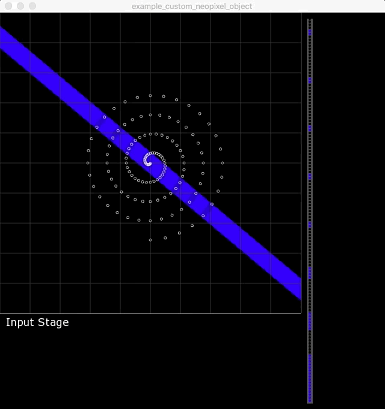

If you would like to contribute to the addon feel free to fork, hack and mod the code.
Also drop me a line and let me know how you end up using the addon.

[@david_haylock](https://twitter.com/david_haylock)

## Requirements

- openFrameworks v0.9.0+
- ofxNetwork - comes as part of the openFrameworks download
- Fadecandy unit @scanlime
- Fadecandy server <a href='https://github.com/scanlime/fadecandy'>https://github.com/scanlime/fadecandy</a> 
- Some examples require additional addons
- [ofxSyphon](https://github.com/astellato/ofxSyphon)
- [ofxAutoReloadedShader](https://github.com/andreasmuller/ofxAutoReloadedShader)

## What the addon includes

- The ofxOPC client class
- ofxNeoPixelRing
- ofxNeoPixelStrip
- ofxNeoPixelGrid
- ofxNeoPixelJewel
- ofxCustomNeoPixel

## Getting Started

- After downloading ofxOPC, place it inside your openFrameworks addon folder.

- Create a new openFrameworks project in Project Generator and select the ofxOPC and ofxNetwork addons.

- Alternatively you will need to add the addons manually, drag and drop the folders into the addon folder in xCode. Then make sure the paths are linked inside Build Settings. 

- In your testApp.h or ofApp.h file, link the addon's .h file, by adding  ```#include "ofxOPC.h"``` underneath ```#include "ofMain.h"```.

- Create an ofxOPC client and a Neopixel unit in your .h file.

```
	ofxOPC opcClient;
	ofxNeoPixelRing ring;
```

- Then in the .cpp file setup the LED unit and the OPC client.

```
	opcClient.setup("127.0.0.1", 7890);
	opcClient.setupStage(500,500);
	ring.setupLedRing(posX,posY,numLeds,spacing);
```

- A new feature is the Stage. The stage is where you draw your graphics for the leds. Essentially its an FBO! But it gives you access to the pixel data of the screen. In the update function call:

```
    opcClient.beginStage();
    
    opcClient.drawDefaultEffects(effect);
    //or your own graphics
    opcClient.endStage();
    
```
- Then write your data to the leds

````
if (!opcClient.isConnected()) 
{
	opcClient.tryConnecting();
}
else
{
	opcClient.writeChannelOne(ring24px.colorData());
}
````

- Draw the resulting data to our visualiser

```
    ofBackground(0);
    opcClient.drawStage(hide);
    ring12px.drawGrabRegion(hide);
    ring12px.drawRing(opcClient.getStageWidth()+100, 50);
```

- Your Leds should start to flash or fade depending on what you put underneath the grabber.

- See the examples for more specific details on each of the Neopixel units.

## Examples
<!--  -->

Example | Image 
--- | ---
ofxNeoPixelRings  |	
ofxNeoPixelStrips | 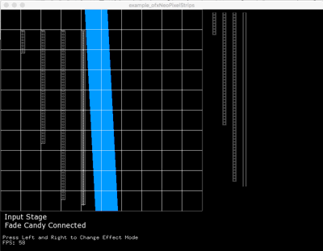
ofxNeoPixelGrids | 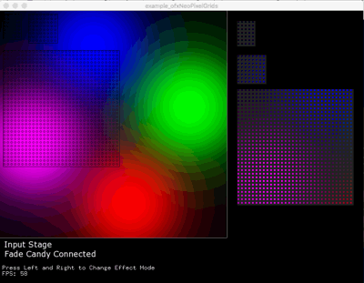
Big Grid | 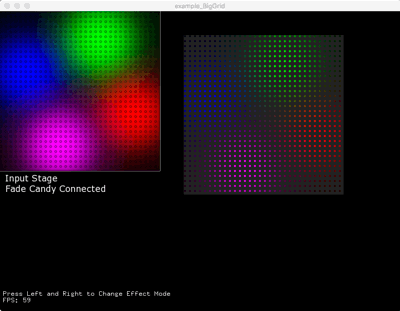
Multiple Strips | 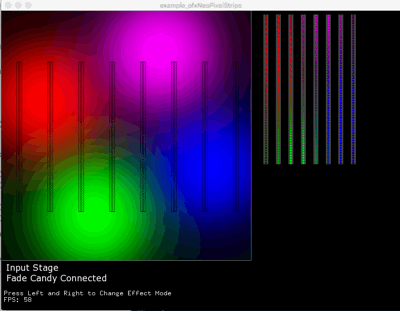
Multiple Neopixel units and Syphon | 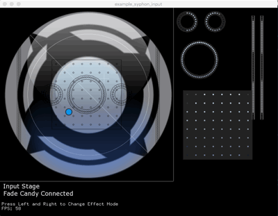
Chained Neopixels | 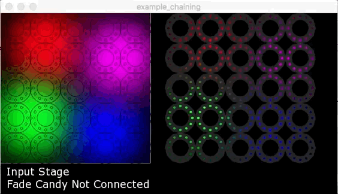
Custom Neopixels | 
Generic Neopixels | 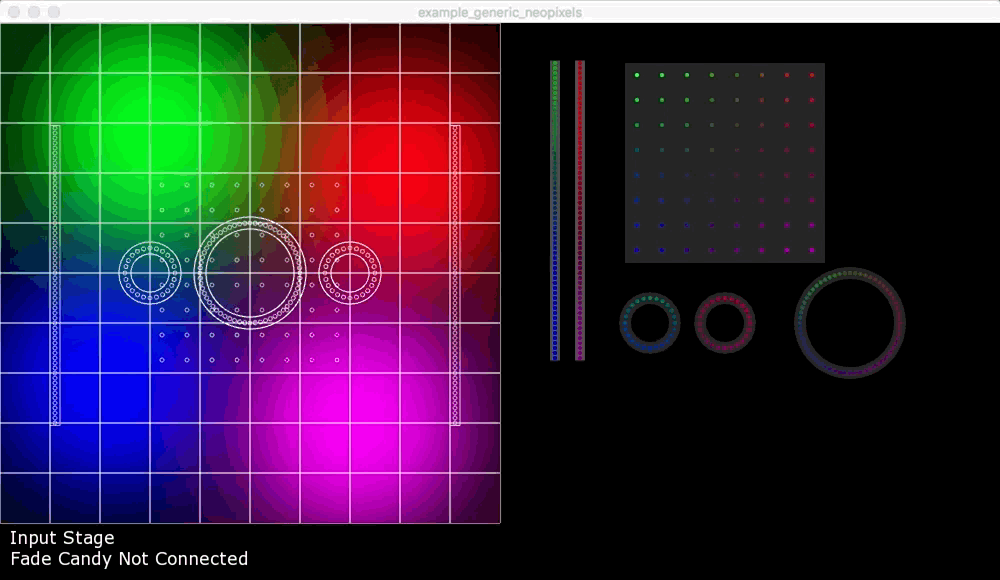
Shader | 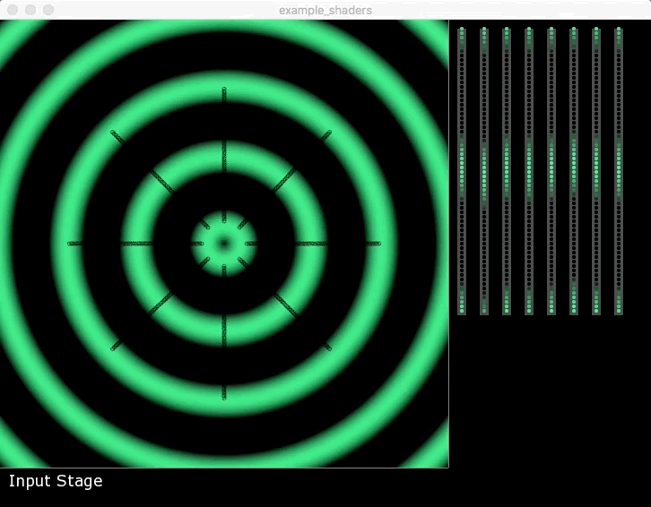 
x-Osc | 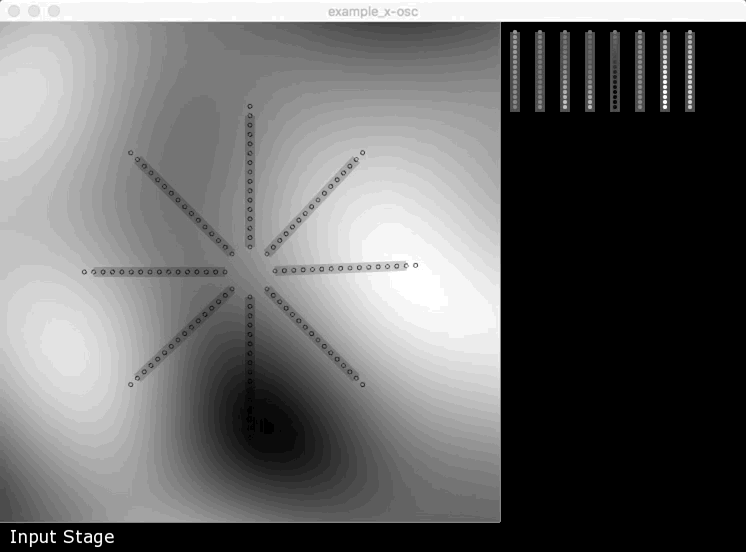 
Multiple Fadecandy's | 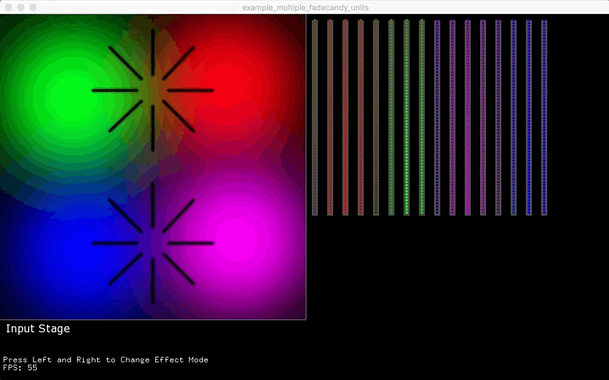

## Important 

The Fadecandy drives 8 x 64 LEDS = 512 LEDs, thats one DMX Universe. However, each pin only drives 64 LEDs. If you want to connect 1 or more units with 64 LEDs each, separate the data accross two channels. For clarity and less risk of overwriting your data.

<code>
	opcClient.writeChannelOne(ring60px.colorData());
	opcClient.writeChannelTwo(ring60px.colorData());
</code>

## Multiple Fadecandys

There is an example that should drive 1024 leds. (I currently dont have two Fadecandys) 
When running this example, you will need to run the ./fcserver with a unique config file. I've uploaded one inside the example bin/data folder. 

For more information please read [@scanlime](https://github.com/scanlime/fadecandy/blob/master/doc/fc_server_config.md) server configuration readme.

##Grids
If you would like to use the 32x32grid please alter line 24 of ofOPC.cpp from

<code>uint16_t data_length = 8 * 64 * sizeof(OPCPacket_SPCData_t);</code>

to 

<code> uint16_t data_length = 16 * 64 * sizeof(OPCPacket_SPCData_t);</code>

To use the 32x32 grid check this guide.

<a href='http://docs.pixelmatix.com/SmartMatrix/'>http://docs.pixelmatix.com/SmartMatrix/</a>

Thanks to @rorypickering for the link.
